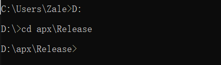
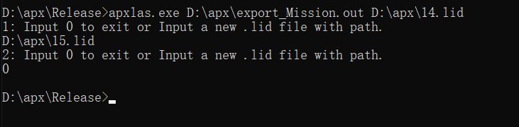

# bag转lid文件

首先获得bag文件，然后打开命令提示符进入到bag2lid.py文件下，运行

```
python bag2lid.py D:\yourbag.bag
```

后面需要添加你bag的路径，然后会相同的路径下生成同名的lid文件。

# lid、out文件转成las

解压Release.zip，然后打开命令行进入到这个目录中，如：



然后按如下方式输入参数



运行exe需要在后面加入.out文件路径，然后是.lid文件路径，回车，等待程序提示“Input 0 to exit.....”，这时程序会在lid文件同一目录下生成同文件las文件和相应的轨迹，也是las文件。这时如果还想往las文件输入点云，在输入一个lid文件名即可，如上图。如果想要退出，输入0即可。

las文件的x为经度(deg)，y为纬度(deg)，z为海拔高度。需要特定的转换。